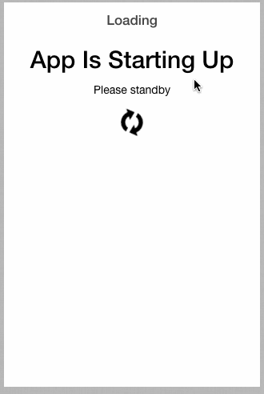

ionicDynamicRouting
===================

Sample of using Ionic tabs with dynamically generated routing, states, and controllers.

#Demo

The names and quantity of the tabs are unknown until retrieved from a service.

#Issues
- How can this be done without using the `app` global variable?
- Using interpolated `ion-nav-view` that is not currently supported by Ionic.  See :
 - https://github.com/driftyco/ionic/pull/1526
 - https://github.com/driftyco/ionic/issues/1503

#Credits
- This concept was taken from a blog post by Alex Feinberg : http://alexfeinberg.wordpress.com/2014/03/08/dynamically-populating-angular-ui-router-states-from-a-service/
